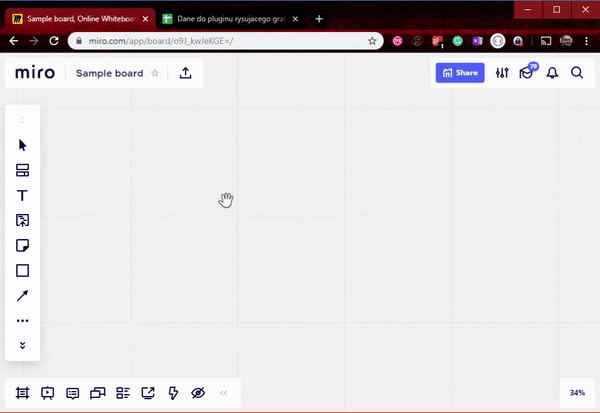
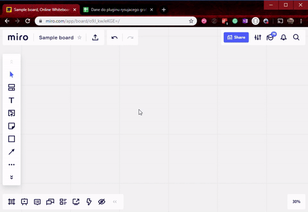

# Plugin for Miro - import charts

This plugin allows to easily import charts from spreadsheets/tables into Miro. 

### Currently supported charts
 Org chart
 

Gantt chart

## Installation
[CLICK HERE](https://miro.com/oauth/authorize/?response_type=token&client_id=3074457347050462782&redirect_uri=https://kaszaq.github.io/miro-chart-importer/installComplete.html) to install plugin in Miro.

## Sample data

Sample data to play around with this plugin is available [here](https://docs.google.com/spreadsheets/d/1Sw2g8WMVEoN1WZcd3oco1MXBeZVRDkFr__USVw8HF4Y/edit?usp=sharing)

## Why

There are types of charts that once created you wish to modify them, change they way they look, adjust a little. On daily basis you have this data in spreadsheet or at least you can export it into spreadsheets.
However it is not as simple then to draw them all. For instance the way you can adjust org chart in Google Sheets is almost non existant. With Miro you do not have those limitations however importing this data might be 
very time consuming.

With this plugin it is possible to import this data into Miro and automatically convert it into initial charts you can later on adjust to your needs.

## Use case

* To simplify creation of charts in Miro that would take otherwise a lot time to recreate.
* To have a simple way of adjusting in Miro the UX of charts where other tools, like spreadsheets, fail.

Note: some charts that could be added to this plugin, for instance line chart, might actually not have too high value when for instance google spreadsheets create quite nice and sufficient to most use cases graphs like that and user could just copy paste the image of such graph into Miro.

## Known issues & upcoming features
* currently draws only 3 month forward, would be better to have this selected by the user
* which timezone is this actually? Code should handle this for instance by setting the timezone in metadata
* would be nice if users could test functionality of changing days somehow using modal on bottom? Otherwise then can only assume, but maybe that is suffcient?